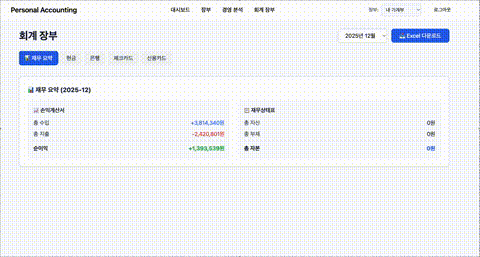

# 🤖 AI 기반 복식부기 회계 시스템 (Backend)

자연어 거래 입력을 복식부기 분개로 변환하는 과정에서 생기는 불확실성을  
**도메인 규칙으로 통제**하고, **AI 지연/비용/정합성 문제를 함께 해결**한 프로젝트입니다.


## 한눈 요약

- **핵심 과제**: 자연어 입력을 안전한 분개(차변/대변)로 변환
- **핵심 해결**:
  - 도메인 계층에서 대차평형/계정과목 제약 검증
  - WebFlux 기반 비동기 처리로 AI API 지연 대응
  - Gemini Context Caching으로 반복 프롬프트 비용 최적화
- **결과**:
  - 잘못된 분개는 저장 단계에서 차단
  - 동시 요청 시 스레드 점유 문제 완화
  - 재무제표 조회 쿼리 최적화(Fetch Join + QueryDSL)

---

## 내가 집중한 문제

### 1) 자연어 입력의 정합성 보장
**문제**
- AI 응답을 그대로 저장하면 계정 누락/금액 불일치로 회계 무결성 붕괴 가능

**해결**
- AI는 보조 역할로 두고, 저장 직전 도메인 규칙으로 최종 검증
- `차변 합계 == 대변 합계`를 만족하지 않으면 저장 실패

**포인트**
- 모델 출력이 흔들려도 핵심 비즈니스 규칙은 항상 동일하게 유지

### 2) AI API 지연으로 인한 처리량 저하
**문제**
- 외부 AI API 응답 대기(2~10초) 동안 요청 처리 스레드 점유

**해결**
- WebFlux `Mono<T>` 기반 논블로킹 처리
- 블로킹 작업(DB/Redis)은 `boundedElastic`로 분리

**포인트**
- @Async보다 요청량 증가 시 제어/조합이 쉬운 흐름으로 설계

### 3) AI 호출 비용 최적화
**문제**
- 매번 동일한 시스템 프롬프트를 보내 토큰 낭비

**해결**
- Gemini Context Caching 적용

**포인트**
- 반복 구간을 캐시해 호출당 유효 페이로드 비중을 높임

### 4) 재무 조회 성능


**문제**
- 거래-분개-계정 조회 시 N+1 발생

**해결**
- Fetch Join + QueryDSL 동적 조건

**포인트**
- 조회 쿼리 수를 줄여 리포트 응답을 안정화

---

## 담당 역할

- 백엔드 아키텍처 및 도메인 모델 설계
- AI 연동 흐름 설계(프롬프트/캐싱/예외 처리)
- 인증(JWT + Refresh Rotation), Redis 세션/블랙리스트
- 재무 리포트 쿼리 최적화
- 테스트 작성 및 품질 게이트 유지

---

## 기술 스택

| 기술 | 적용 이유 |
|------|-----------|
| **Java 21 / Spring Boot 3.5** | 최신 LTS 기반, 생산성과 안정성 |
| **Spring WebFlux** | AI 응답 지연 상황에서 논블로킹 처리 |
| **PostgreSQL** | 금융 데이터 트랜잭션 정합성 |
| **Redis** | 토큰/세션/블랙리스트/캐시 처리 |
| **QueryDSL** | 타입 안전한 동적 조회 |
| **Flyway** | 스키마 버전 관리 |
| **JUnit5 / Mockito** | 단위/통합 테스트 자동화 |

---

## 아키텍처

```text
Presentation    Controller
      ↓
Application     UseCase (Auth, AI Chat, Report)
      ↓
Domain          Entity, Service, Repository Interface
      ↓
Infrastructure  JPA, Redis, Gemini Client
```

- **의존성 역전**: `AiClient` 인터페이스를 Domain에 두고 구현은 Infrastructure에 배치
- **도메인 독립성**: 핵심 비즈니스 규칙이 프레임워크/외부 API 변화에 직접 흔들리지 않도록 분리

### 복식부기 모델
```text
Transaction
  └── JournalEntry
        ├── TransactionDetail (차변) -> Account
        └── TransactionDetail (대변) -> Account
```

---

## 테스트

- **173+ 테스트 케이스** 기반으로 핵심 로직 회귀 방지
- 검증 포인트:
  - 복식부기 무결성
  - 인증/토큰 흐름
  - AI 응답 파싱/예외 처리
  - 리포트 조회 로직

---

## 실행 방법

```bash
git clone https://github.com/leejiyun1/personal-accounting.git
cd personal-accounting

cp .env.example .env
# GEMINI_API_KEY 등 필수 값 설정

docker-compose up -d
./gradlew bootRun
```

- Swagger: `http://localhost:8080/swagger-ui.html`

---

## 포트폴리오 참고 자료

- 설계 배경/트레이드오프 정리: `docs/presentation.pdf`

---

## Contact

**이지윤 (Jiyun Lee)**

- Email: poi20701556@gmail.com
- GitHub: [@leejiyun1](https://github.com/leejiyun1)

개발 기간: 2025.09 ~ 2026.01
