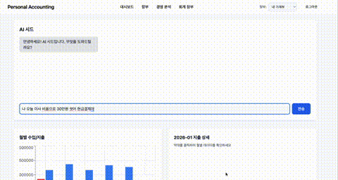

# 🤖 AI 기반 복식부기 회계 시스템

> 자연어로 거래를 입력하면 AI가 복식부기를 자동 생성하는 개인 회계 시스템



---

## ⚡ 핵심 기능

### 1. AI 대화형 거래 입력

```
"오늘 급여 500만원 받았어" 
→ AI가 추가 질문: "어떤 계좌로 받으셨나요?"
→ "신한은행으로"
→ 복식부기 자동 생성 (차변: 보통예금 / 대변: 급여)
```

### 2. 복식부기 자동 처리

- 차변/대변 자동 분개
- 대차평형 원칙 검증
- 분개장(Journal Entry) 자동 생성

### 3. 재무제표 자동 생성

- 손익계산서 (Income Statement)
- 재무상태표 (Balance Sheet)
- 월별/카테고리별 통계

---

## 🛠️ 기술 스택

| 구분 | 기술 |
|------|------|
| **Backend** | Spring Boot 3.5, Java 21 |
| **Database** | PostgreSQL 16, Redis 7 |
| **AI** | Google Gemini API |
| **Security** | JWT (Access + Refresh Token Rotation) |
| **Test** | JUnit 5, Mockito (173+ 테스트) |
| **DevOps** | Docker, Docker Compose |

### 주요 기술 적용

| 기술 | 적용 내용 |
|------|----------|
| **WebFlux (논블로킹)** | AI API 호출 시 스레드 블로킹 방지, boundedElastic 스케줄러로 DB 작업 분리 |
| **QueryDSL** | 타입 안전한 동적 쿼리, 복잡한 검색 조건 처리 |
| **MapStruct** | 컴파일 타임 DTO 변환 (Reflection 없음) |
| **Flyway** | DB 스키마 버전 관리 |
| **Bucket4j** | Rate Limiting (로그인 시도 제한) |

---

## 🏗️ 아키텍처

### 시스템 구조
```
┌─────────────┐      ┌─────────────┐      ┌─────────────┐
│  Frontend   │ HTTP │   Backend   │ API  │ Gemini AI   │
│  (React)    │─────▶│ Spring Boot │─────▶│ (논블로킹)   │
└─────────────┘      └─────────────┘      └─────────────┘
                            │
                     ┌──────┴──────┐
                     ▼             ▼
              ┌──────────┐   ┌──────────┐
              │PostgreSQL│   │  Redis   │
              │ (거래/장부) │   │(세션/캐시)│
              └──────────┘   └──────────┘
```

### 레이어 구조 (Clean Architecture)
```
┌──────────────────────────────────────────┐
│  Presentation                            │  Controller, DTO
├──────────────────────────────────────────┤
│  Application                             │  UseCase (AI Chat, Report)
├──────────────────────────────────────────┤
│  Domain                                  │  Entity, Service, Repository Interface
├──────────────────────────────────────────┤
│  Infrastructure                          │  JPA, Redis, Gemini Client
└──────────────────────────────────────────┘
```

### 복식부기 도메인 모델
```
Transaction (거래)
    └── JournalEntry (분개)
            ├── TransactionDetail (차변)
            │       └── Account (계정과목)
            └── TransactionDetail (대변)
                    └── Account (계정과목)
```

---

## 🚀 Quick Start

```bash
# 1. 저장소 클론
git clone https://github.com/leejiyun1/personal-accounting.git
cd personal-accounting

# 2. 환경변수 설정
cp .env.example .env
# .env 파일에 GEMINI_API_KEY 등 설정

# 3. Docker 컨테이너 실행 (PostgreSQL, Redis)
docker-compose up -d

# 4. 애플리케이션 실행
./gradlew bootRun

# 5. 접속
# API: http://localhost:8080
# Swagger: http://localhost:8080/swagger-ui.html
```

---

## 📚 문서

- 📄 **[프로젝트 상세 설명 (PPT)]** - 아키텍처 결정 과정, 기술적 챌린지
- 💻 **[API 문서 (Swagger)]** - http://localhost:8080/swagger-ui.html

---

## 👨‍💻 Contact

**이지윤** (Jiyun Lee)

- 📧 Email: poi20701556@gmail.com
- 🐙 GitHub: [@leejiyun1](https://github.com/leejiyun1)

---

**개발 기간**: 2025.09 ~ 2026.01 (4개월)
